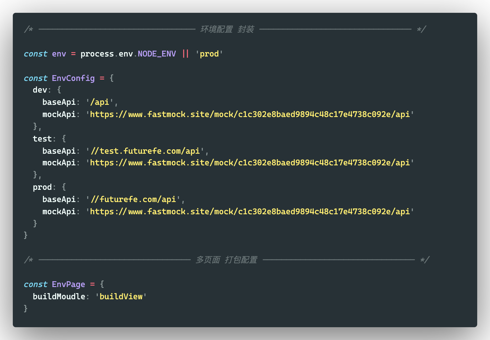

<!--
 * @Descripttion:
 * @repository: https://github.com/luzhonglai
 * @Author: ZhongLai Lu
 * @Date: 2021-07-23 23:53:50
 * @LastEditors: Zhonglai Lu
 * @LastEditTime: 2021-09-03 01:40:02
-->

# multiple-vue3-pc (vue3 与 tsx 体验版)

> 🔥 🎉 Vue 3.0 + TypeScript + Vue-Router 4.0 + Element-Plus + Axios + Vuex 多页面开发模版

## 模版亮点

- 多页面模块开发
- mock 数据模拟
- 接口 Log 窗口调试，
- Eelment-plus 组件按需加载
- less/sass
- Webpack 编译优化
- Vuex 封装
- Axios 封装
- Eslint+Pettier 代码规范

### 组织结构

```base
├── mock        ---- mock数据
│   └── modules
├── public
├── src
│   ├── api     ---- api管理
│   ├── assets  ---- 静态资源
│   ├── common  ---- 公共资源
│   ├── layout  ---- 公告布局
│   ├── plugins ---- 模版插件
│   ├── router  ---- 路由模块
│   ├── store   ---- 全局vuex
│   ├── styles  ---- 全局样式
│   ├── types   ---- 类型配置
│   ├── utils   ---- 公共函数
│   └── views   ---- 视图页面
└── tests
    └── unit
```

### 功能、组件的封装

- 按钮权限 ✅
- 动态路由 ✅
- 性能监控 ✅
- 请求日志 ✅
- CDN 图片上传

### 准备工作

```bash
#依赖安装方式
npm install

#安装依赖
yarn install

#启动
yarn run serve
```

### 多页面配置

```javascript
// 脚本指定目录进行打包
yarn run serve  appName 'demo'

// 配置打包多页面
```



### 优化总结

```javascript
/* 
    编译优化、热更新缓存原理、提升40%
*/
const HardSourWebpackPlugin = require('HardSourWebpackPlugin')
```

### 最后
